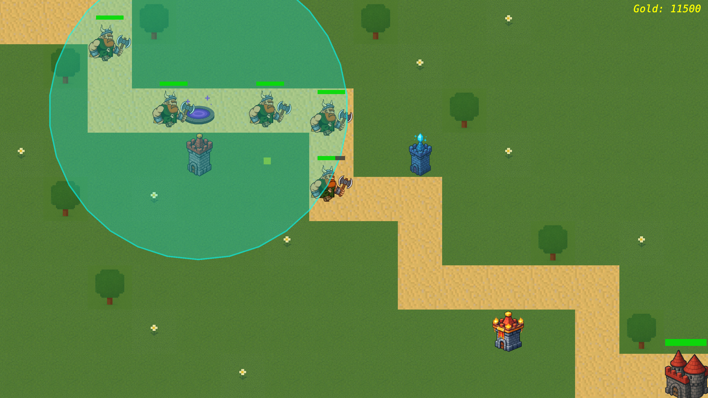

# Tower Defense: Классическая стратегия на C++

**Tower Defense** — это реализация классической игры в жанре "защиты башен", написанная на современном C++17. Проект демонстрирует применение принципов SOLID и паттерна MVP для создания расширяемой архитектуры, использование многопоточности для оптимизации производительности и интеграцию внешних библиотек для графики и работы с данными.

 

## Особенности ✨

*   **Геймплей:** Классическая механика Tower Defense с волнами врагов, несколькими типами башен и улучшениями.
*   **Чистая архитектура:** Код строго следует принципам SOLID и использует паттерн **MVP (Model-View-Presenter)**, что облегчает добавление нового функционала (новые враги, башни, правила).
*   **Многопоточность:** Группы врагов и башен обрабатываются в отдельных потоках для обеспечения плавного FPS даже при большом количестве юнитов.
*   **Сохранение и загрузка:** Использование библиотеки `yaml-cpp` для сохранения/загрузки прогресса игры в человекочитаемом формате YAML.
*   **Модульные тесты:** Ключевые модули покрыты unit-тестами с использованием `Catch2` — современного фреймворка для тестирования на C++.
*   **Визуализация:** Графика на `SFML 2.6`.

## Стек технологий 🛠️

*   **Язык:** C++20
*   **Сборка:** CMake (версия 4.0)
*   **Графика:** [SFML](https://www.sfml-dev.org/) (Simple and Fast Multimedia Library)
*   **Конфигурации/Сериализация:** [yaml-cpp](https://github.com/jbeder/yaml-cpp)
*   **Тестирование:** [Catch2](https://github.com/catchorg/Catch2) — header-only фреймворк для модульного тестирования
*   **Многопоточность:** `std::thread`, `std::mutex`, `std::atomic` из стандартной библиотеки C++

## Архитектура и принципы SOLID 🏗️

Проект спроектирован с использованием комбинации паттерна **MVP (Model-View-Presenter)** и принципов SOLID для максимальной расширяемости и тестируемости.

### MVP (Model-View-Presenter)

Архитектура разделяет приложение на три ключевых компонента:

```
[Model] (Данные и логика игры)
    ↑
    ↓
[Presenter] (Промежуточный слой)
    ↑
    ↓
[View] (Отображение SFML)
```

*   **Model (Модель):**
    *   Содержит чистую игровую логику, не зависящую от графики
    *   Не знает о существовании SFML или любого другого способа отображения
    *   Легко тестируется без графики
*   **View (Представление):**
    *   Отвечает только за отрисовку через SFML
    *   Получает данные от Presenter и визуализирует их
    *   Обрабатывает пользовательский ввод и передает команды в Presenter
*   **Presenter (Представитель):**
    *   Связывает Model и View
    *   Получает команды от View (клики мыши, нажатия клавиш)
    *   Обновляет Model согласно командам
    *   Преобразует данные Model в формат DTO для View

## Многопоточность ⚙️

Для повышения производительности обработка игровых объектов распределена по нескольким потокам:

*   **Поток обработки врагов:** Вычисляет перемещение, коллизии и состояние всех врагов на карте.
*   **Поток обработки башен:** Рассчитывает поиск цели и нанесение урона для каждой башни.

Такое разделение позволяет эффективно использовать многоядерные процессоры — каждая группа объектов (враги и башни) обрабатывается параллельно, что критически важно при большом количестве юнитов на экране.

### Детали реализации:
- **Группа врагов** обрабатывается в выделенном потоке: обновление позиций, проверка достижения цели, применение эффектов
- **Группа башен** обрабатывается параллельно в другом потоке: сканирование радиуса, выбор цели, перезарядка и выстрелы

Синхронизация данных между потоками осуществляется через мьютексы для защиты общего состояния игры (списки врагов и башен), что предотвращает состояние гонки при одновременном доступе.

## Установка и запуск 🚀

### Предварительные требования
*   Компилятор с поддержкой C++20
*   CMake 4.0
*   Установленные библиотеки:
    - SFML 2.6+
    - yaml-cpp
    - Catch2 

### Сборка проекта

1.  Клонируйте репозиторий:
    ```bash
    git clone https://github.com/yaroslavvoropaev/tower-defense.git
    cd tower-defense
    ```
2.  Создайте директорию для сборки:
    ```bash
    mkdir build && cd build
    ```
3.  Запустите CMake и сборку:
    ```bash
    cmake ..
    cmake --build .
    ```

### Запуск игры
После успешной сборки исполняемый файл будет находиться в папке `bin/`.
```bash
./bin/TowerDefense
```

## Сохранения 💾
Файлы сохранений находятся в директории `save_load/` в формате YAML. Пример структуры файла сохранения:
```yaml
tower:
  simple_tower:
    - id: 0
      type: simple_tower_weakest_strategy
      range: 4.5
      level: 1
      x: 0
      y: 0
      cost: 700
      strategy: weakest
      params:
        damage: 20
        rate_of_fire: 2
    - id: 0
      type: simple_tower_strongest_strategy
      range: 4.5
      level: 1
      x: 0
      y: 0
      cost: 700
      strategy: strongest
      params:
        damage: 30
        rate_of_fire: 1.2
```


